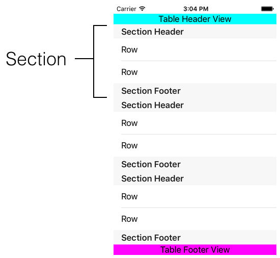

# Concepts and Terminology

Table views are among the most commonly used UI widgets in iOS. From your email inbox to your Twitter feed, your contacts list to your settings, table views are used just about everywhere. If you are looking at a list - short or very very long - of even vaguely related items, chances are pretty good that you're looking at a UITableView.

Prior to iOS 6, the use of UITableView would almost be a certainty. In iOS 6, Apple introduced UICollectionView which borrows many of the same concepts, and can be made to look quite similar to a table view if you want to spend the effort. I do not currently intend to discuss UICollectionView as part of this series, but I will say that understanding how table views work will go a long way towards understanding how collection views work, so time spent here will not be wasted. If you are trying to decide which you need, then a basic guideline would be to use a table view for vertically scrolling content, and a collection view for horizontally scrolling content.

## Scroll View 

Let's start with the definition of UITableView, from the UIKit header files:

```objc
// Objective-C
@interface UITableView : UIScrollView <NSCoding>
```
```swift
// Swift
public class UITableView : UIScrollView, NSCoding
```

UITableView is defined as inheriting from UIScrollView. And this is a distinction that is worth pointing out: A table view does not _have_ a scroll view, it **is** a scroll view. It is a scroll view that has been highly customized to display and manage subviews in an orderly fashion, but at its core it is just a scroll view. If you really wanted to, you could slap a bunch of views into any plain UIScrollView and wind up with a visual that is every bit the same as what we see with UITableViews. But hopefully, long before we finish with this series, it will become clear exactly what UITableView provides and does for you, and thus why you likely won't want to try to tackle those aspects on your own.

Since it is fundamentally a scroll view, it is worth remembering that any subviews you add are going to scroll. This will be important later when we talk about UITableViewController. For now, just plant in your mind that if you have a view that you do NOT want to scroll, then you should not add it to a UITableView (or at minimum be prepared to jump through hoops to make it stationary).

## Definitions

Now let's take a look at some definitions:



This may look a little busy, so for now just pick out the key words **section** and **row**.

The **row** is sort of like the basic unit of measurement for table views. Each name in your Contact list appears in a row, er, more specifically appears in a cell view that is shown for that particular row.

Rows can be grouped together into **sections**. It's a design choice to make, but doing so enables options such as the section headers, which you see in Contacts with the "A", "B", "C" banners as you scroll, and also the strip of letters that can appear on the side of a table view that lets you quickly jump around in the table.

Only a few items are shown here, but there can be many many sections, and there can be many many rows. Also shown are the standard section header and footer views (these can customized with your own views), and the table as a whole also has a header and footer view which can also be customized. As these items are all subviews of the table view, they all scroll together, with an exception as noted in a moment. Over the course of the series, we will look at how to customize everything that you see here.

If the section and row are the units of measurement, the **index path**, specifically NSIndexPath, represents the coordinate system. Just like (x,y) = (3,7) tells you where to draw a point on a graph, (section, row) = (3,2) tells you where in a table view something is located. Just like a coordinate has an x component and a y component, an index path has a section component and a row component. Everything is vertical here in table view land, so the analogy isn't perfect, but the general idea applies. If we were to apply labels that reveal the locations, it would look like this:


The first aspect to notice here is that sections and rows each begin at 0, just like array indices do. That's helpful since we'll be dealing with arrays quite frequently in the use of table views. Next, notice that the row number starts over in each section. I see "Row 0" 4 times, and this corresponds with the 4 sections that are currently shown. This will be very important when we deal with sectioned table view data later. It will not be sufficient to simply say "Row 0", as you can see here that there would be more than one answer for that. You will have to be more specific, such as "Row 0 in Section 2". The index path is what allows us to provide that extra detail.

From:
[A Reasonably Complete Guide to UITableView](https://github.com/BriTerIdeas/Book-UITableViewGuide), by Brian Slick
